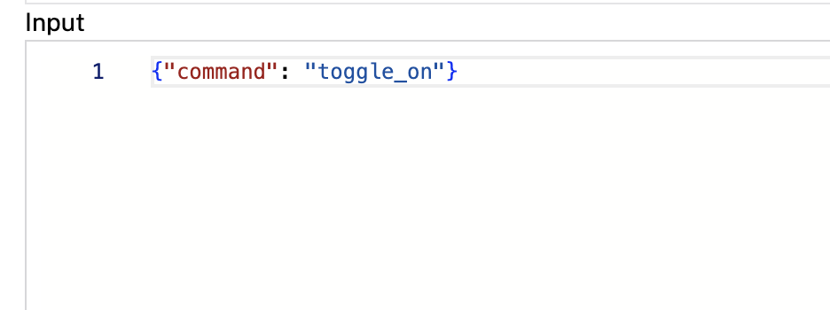

# Kasa smart plug

This module implements the [rdk generic API](https://github.com/rdk/generic-api) in a `joyce:kasa:switch` model.

With this model, you can manage a Kasa smart plug:
- toggle on
- toggle off
- toggle switch

## Build and Run

To use this module, follow these instructions to [add a module from the Viam Registry](https://docs.viam.com/registry/configure/#add-a-modular-resource-from-the-viam-registry) and select the `joyce:kasa:switch` model from the [`kasasmartplug` module]([https://app.viam.com/module/rdk/joyce:kasa:switch](https://app.viam.com/module/joyce/kasasmartplug)).

## Configure your generic switch

> [!NOTE]  
> Before configuring your generic component, you must [create a machine](https://docs.viam.com/manage/fleet/machines/#add-a-new-machine).

- Navigate to the **CONFIGURE** tab of your robot’s page in [the Viam app](https://app.viam.com/).
- Click on the **Components** subtab and click **Create component**.
- Select the `generic` type, then select the `kasa:switch` model. 
- Enter a name for your generic component and click **Create**.
- From the command line, you can use the `python-kasa` command [`kasa discover`](https://python-kasa.readthedocs.io/en/latest/cli.html#discovery) to  locate the IP address of the connected device. 
- On the new component panel, copy and paste the following configuration template into your generic component’s **CONFIGURE** box, updating with your own connected smart plug's IP address.

  ```json
  {
    "plug_ip": "192.168.1.169"
  }
  ```

> [!NOTE]  
> For more information, see [Configure a Robot](https://docs.viam.com/manage/configuration/).

### Do command

On the **CONTROL** tab, find `DoCommand()`, select your Kasa component, and use the following commands as a key with an empty array as the value, and **Execute** with [`DoCommand`](https://docs.viam.com/components/generic/#docommand).

- `toggle_on`
- `toggle_off`
- `toggle_switch`

- 

**Related modules**
- [`kasa-smartplug-visionswitch`](https://app.viam.com/module/bill/kasa-smartplug-visionswitch) to turn on or off depending on if the vision detection is seen or not
